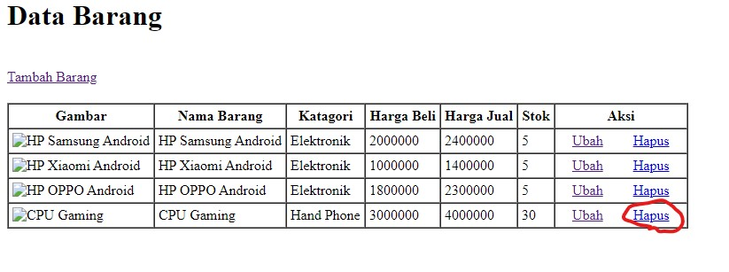

# Alat Alat yang digunakan

1. XAMPP 

 XAMPP adalah sebuah paket perangkat lunak (software) komputer yang sistem penamaannya diambil dari akronim kata Apache, MySQL (dulu) / MariaDB (sekarang), PHP, dan Perl. Sementara imbuhan huruf “X” yang terdapat pada awal kata berasal dari istilah cross platform sebagai simbol bahwa aplikasi ini bisa dijalankan di empat sistem operasi berbeda, seperti OS Linux, OS Windows, Mac OS, dan juga Solaris. 

2. Sublime Text

 Sublime Text adalah aplikasi editor untuk kode dan teks  yang dapat berjalan diberbagai platform operating system dengan menggunakan teknologi Phyton API. Terciptanya  aplikasi  ini  terinspirasi  dari  aplikasi  Vim,  Aplikasi  ini  sangatlah fleksibel  dan  powerfull.  Fungsionalitas  dari  aplikasi  ini  dapat  dikembangkan dengan  menggunakan  sublime-packages.  Sublime  Text  bukanlah  aplikasi  opensource  dan juga aplikasi yang dapat digunakan dan didapatkan secara gratis,  akan tetapi  beberapa  fitur  pengembangan  fungsionalitas  (packages)  dari  aplikasi  ini merupakan hasil dari temuan dan  mendapat dukungan  penuh dari  komunitas serta memiliki linsensi aplikasi gratis. 

# Langkah Langkah 

 Ketiklah localhost/phpmyadmin di Search Pencaharian sejenis Google Chrome, lalu buatlah database bernama "latihan1". 

 Masuklah kedalam database "latihan1" lalu buatlah Tabel "data_barang" di dalam sourch sql lalu klik kirim. 

 Buatlah code sql masukan data kedalam tabel "data_barang" lalu klik kirim. 

 Buatlah folder "lab8_php_database" di dalam xampp/htdocs. 

 Lalu akses folder tersebut melalui Chrome di url ketik localhost. 

 Membuat koneksi ke mysql. 

 Bila berhasil ada tulisan tersebut. 

 Membuat Index. 

 Hasil dari output index.  

 Membuat tambah barang. 

 Hasil dari output tambah barang, dan masukan isian yang di inginkan lalu klik simpan, lihat hasilnya. 

 Bertambah 1 barang yaitu CPU Gaming. 

 Membuat ubah barang. 

 Hasil output Ubah barang, lalu gantilah stok menjadi 30, klik krim dan lihat perubahannya. 

 Stok barang telah berubah. 

 Membuat hapus barang, agar data barang itu terhapus. 

 Klik hapus, dan lihat hasilnya. 

 barang telah terhapus. 

